# s3 버킷 셋업 가이드

Created time: August 15, 2023 4:46 PM

# 1. IAM 설정

- IAM (AWS Identity and Access Management)로 AWS 리소스에 대한 엑세스를 관리하고 보안을 제어하는 서비스이다.
- IAM을 통해 사용자, 그룹 및 역할을 생성하여 보안 강화, 책임 분리 등을 할 수 있다.
- Spring Boot를 통해 S3 버킷에 엑세스하려면 IAM를 통해 사용자를 추가하여 `액세스키`, `비밀 엑세스 키`를 발급 받아야한다.

## A. IAM 사용자 생성

1. AWS의 IAM으로 접속한 후 ‘엑세스 관리 > 사용자’ 탭을 클릭한다.

   

2. ‘사용자 추가’를 버튼을 클릭한다.

   

3. 사용자 이름을 적은 후 ‘다음’ 버튼을 누른다.

   

4. 그룹이 아닌 S3만을 위한 권한이 필요하기 때문에 ‘직접 정책 연결’을 선택한다.

   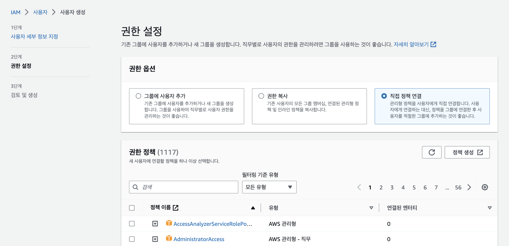

5. ‘권한 정책’에서 `S3`를 검색한 후, `S3FullAccess`를 선택한 후 ‘다음’ 버튼을 누른다.

   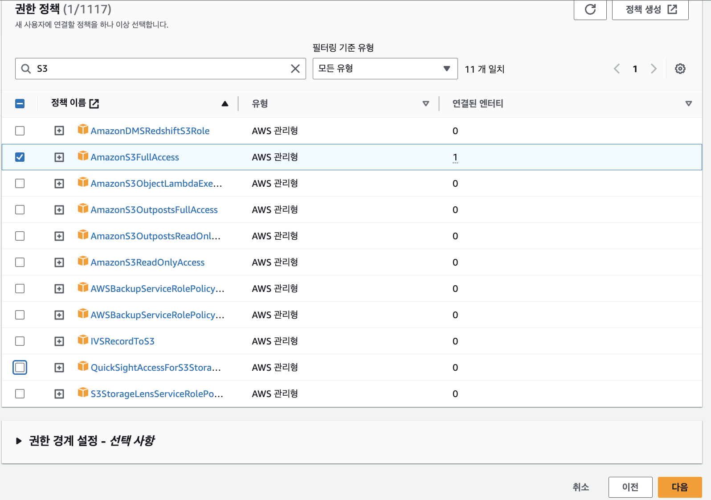

6. 검토한 후 ‘사용자 생성’버튼을 눌러 생성한다.

   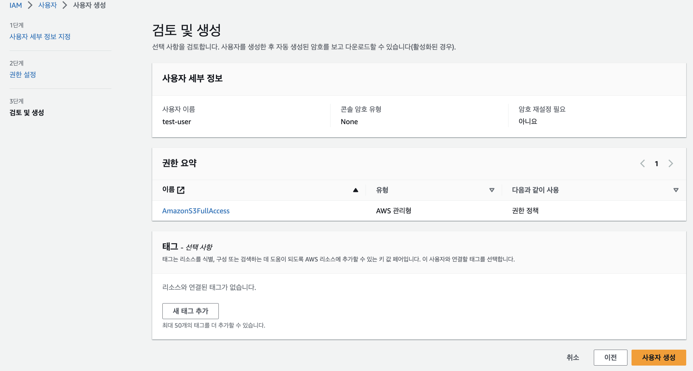

7. 성공적으로 사용자가 생성된 것을 확인할 수 있다.

   

## B. 생성한 사용자 키 발급

1.  생성한 사용자의 이름을 눌러 상세정보 페이지로 이동한다.

    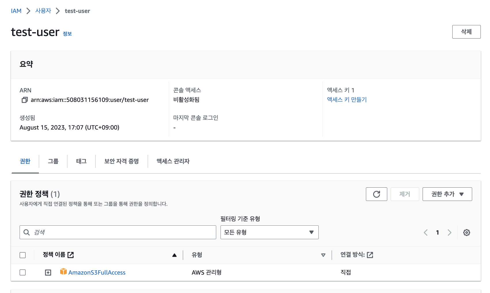

2.  ‘보안 자격 증명’ 탭으로 이동하여 ‘엑세스키’ 부분의 ‘엑세스 키 만들기’ 버튼을 누른다.

    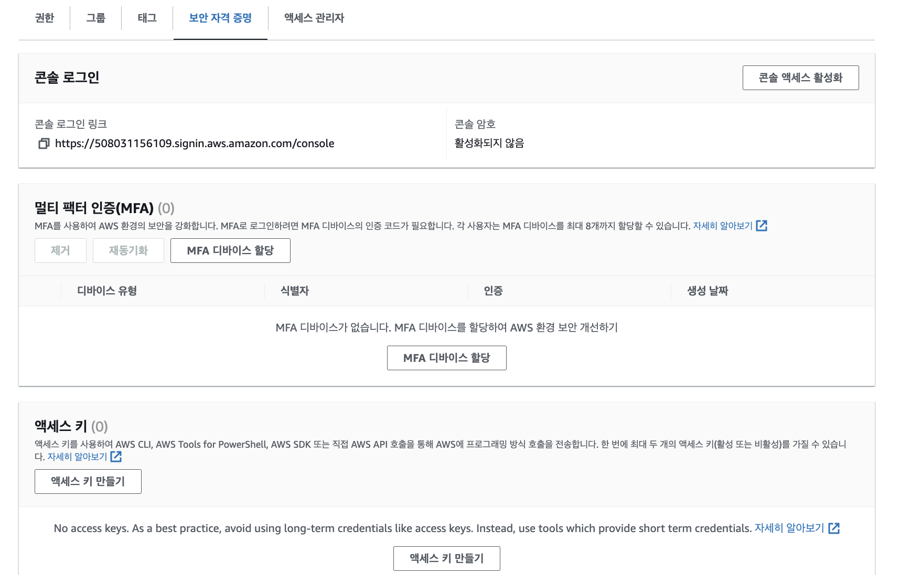

3.  ‘사용 사례’의 ‘AWS 외부에서 실행되는 에플리케이션’을 선택한 뒤 ‘다음’ 버튼을 눌러준다.

    

4.  ‘설명 태그 값’(옵션)을 입력한 후 ‘액세스 키 만들기’버튼을 클릭한다.

    

5.  **[중요] `액세스키`, `비밀 액세스 키`를 반드시 저장하여 기억해둔** 후 ‘완료’ 버튼을 통해 엑세스 키를 생성한다.
    (액세스 키는 생성 시 한번만 보여준다. ‘.csv 파일 다운로드’를 통해 저장해두자.)
    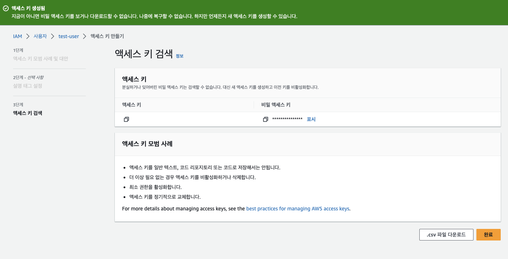
6.  액세스 키 상태를 확인한다.

    

# 2. S3 버킷 구축

## A. 버킷 생성

1. AWS의 S3로 접속한 후 ‘버킷’ 탭의 ‘버킷 만들기’ 버튼을 클릭한다.

   

2. 버킷에 대한 설정을 해준 후 ‘버킷 만들기’ 버튼을 클릭하여 버킷을 생성한다.

   1. 일반 구성에서 버킷 이름(id)과 AWS 리전(버킷 저장 위치)을 설정한다.

      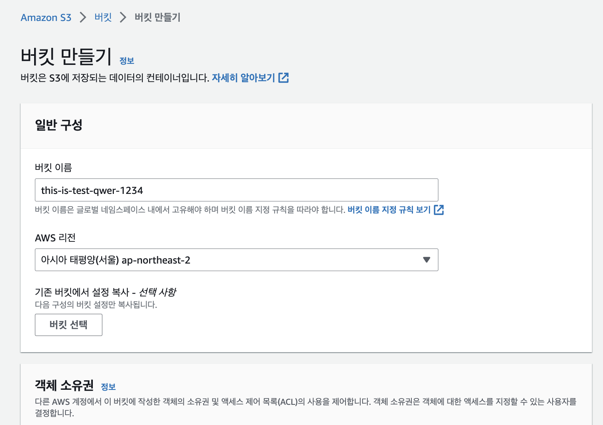

   2. `ACL 활성화됨`을 선택하여 IAM에서 등록한 사용자가 엑세스할 수 있도록 한다.

      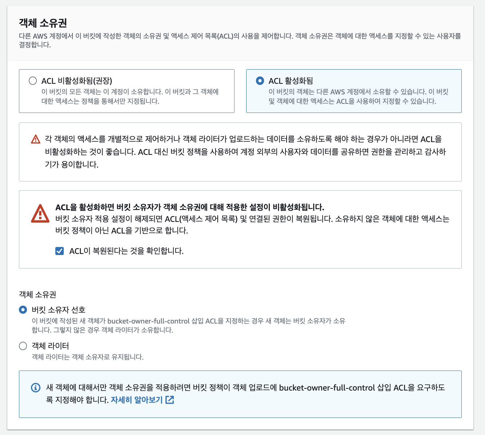

   3. 외부에서 파일을 읽고 쓸 수 있도록 `모든 퍼블릭 액세스 차단`을 비활성화한다.

      

      - 실무에서는 모든 퍼블릭 액세스 차단 혹은 ACL을 통토해스액세세 차단해준다고 한다.

   4. 버킷 버전 관리는 버전별로 파일을 관리해주기 때문에 비용이 많이 들 수 있으므로 `비활성화`해준다.

      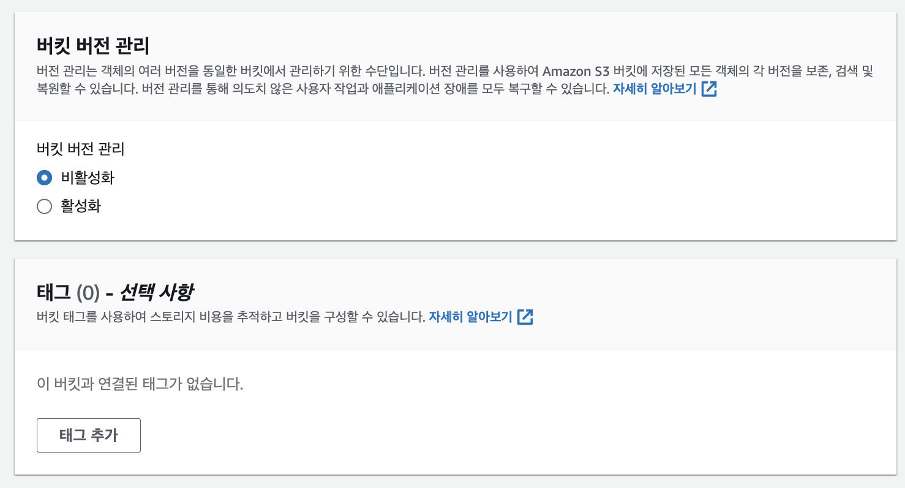

   5. 기본 암호화는 파일 업로드가 잘되는지 확인하기 위하여 `비활성화`해준다.

      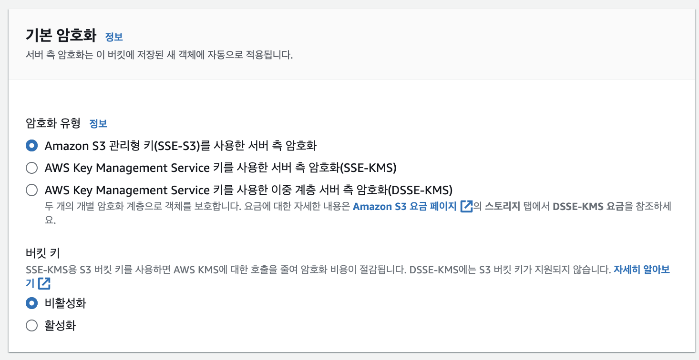

      - 활성화하면 모든 새 객체를 암호화하여 저장하고, 다운로드 시 복호화하여 제공한다.

3. 버킷이 잘 생성되었는지 확인한다.

   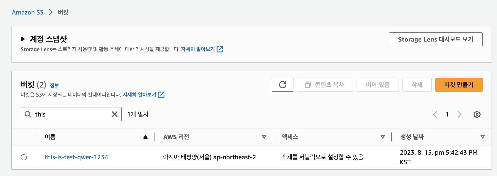

## B. 버킷 정책 설정

- 버킷의 액세스 부분을 보면 ‘객체를 퍼블릭으로 설정할 수 있음’이라고 되어있다. 이는 외부에서 아직 접근이 불가능하다는 것을 뜻한다.
- 외부에서 버킷에 접근이 가능하도록 버킷 정책을 수정해야한다.

1. AWS S3 버킷의 이름을 클릭하여, 상세정보 페이지의 ‘권한’ 탭으로 이동한 후 ‘버킷 정책’의 ‘편집’ 버튼을 누른다.

   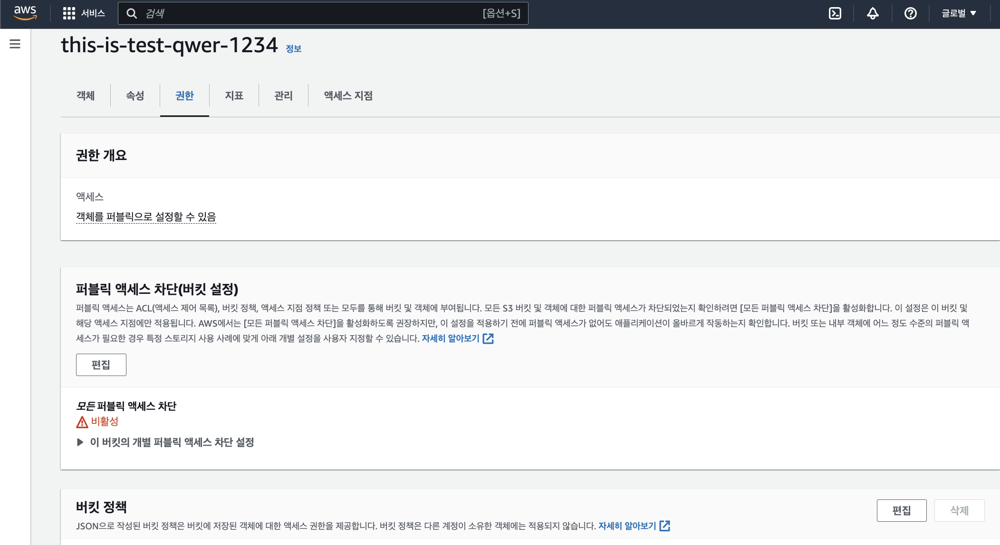

2. ‘정책생성기’ 버튼을 눌러 [AWS Policy Generator](http://awspolicygen.s3.amazonaws.com/policygen.html) 사이트에 접속한다. (이 때, `버킷 ARN`을 복사해두면 좋다.)

   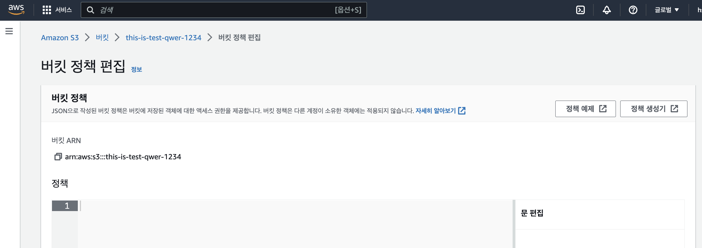

   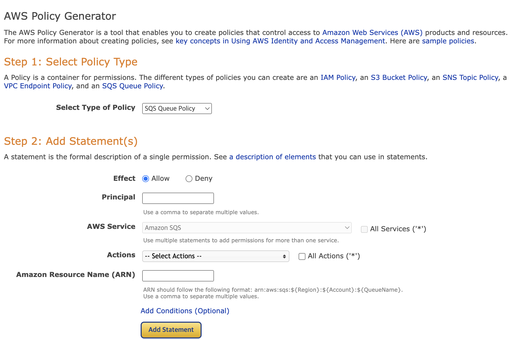

3. 다음과같이 설정한 후 ‘Add Statement’ 버튼을 클릭한다.

   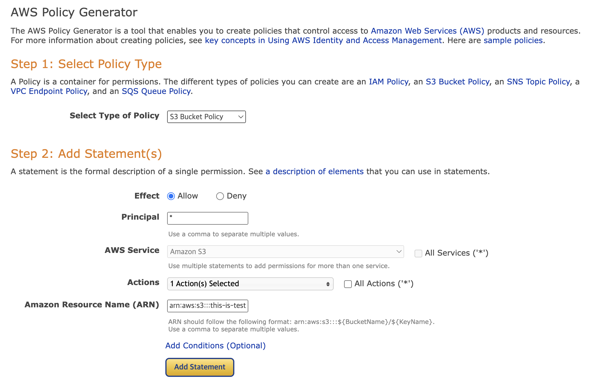

   - `Select Type of Policy`: s3 Bucket Policy
   - `Effect`: allow
   - `Principal`: \*
   - `Actions`
     - getObject
   - `ARN`: {복사해둔`버킷 ARN`}/\*
     - `버킷 ARN`: arn:aws:s3:::{버킷 이름}

4. 정보를 확인한 후 ‘Generate Policy’ 버튼을 누른다.

   

5. Json형태의 정책 결과를 복사한다.

   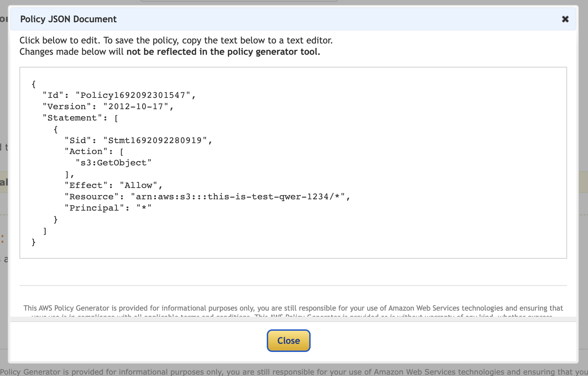

6. 정책에 복사해두었던 Json형태의 정책 데이터를 붙여넣은 후 ‘변경사항 저장’ 버튼을 눌러 저장한다.

   

7. 패이지 새로 고침 후 버킷을 확인하면 엑세스 상태가 퍼블릭이 된 것을 확인할 수 있다.

   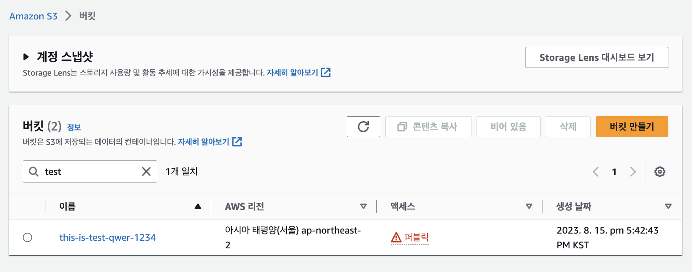

8. 테스트 이미지를 버킷에 업로드 한 후, 객체 디테일 페이지에 들어가 ‘객체 URL’를 주소를 클릭하여 해당 이미지에 접근이 가능한지 확인한다.

   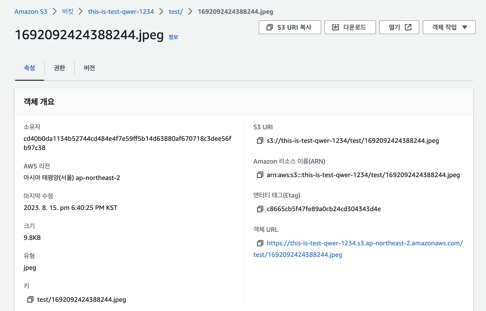
